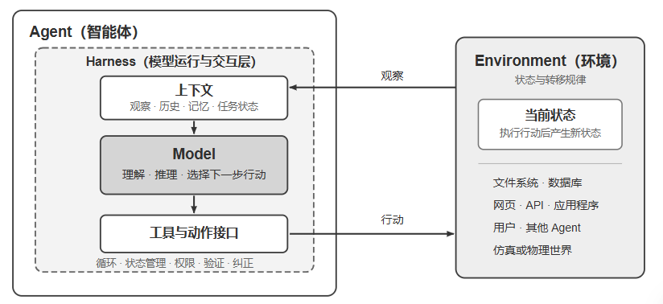

自主规划执行步骤、调用各种工具完成任务，并根据结果不断调整策略的智能系统

Agent 的核心公式、运行循环、工程框架和设计模式,提供统一的术语和参照坐标,建立整体印象

现代 Agent = LLM + 上下文 + 工具。描述 Agent 边界之内的实现，不包含 Agent 与之交互的 Environment（环境）。
-llm: 理解意图、思考规划、做出判断。预训练所积累的世界知识与语言能力，以及后训练所固化的决策策略

- 上下文是眼睛：每个决策点收到并保留的信息表示——来自环境的观察、用户记忆、领域知识、自身状态和任务进展
- 工具是手脚：感知或改变外部世界的接口，包括工具定义、调用协议和适配器——从预定义的工具调用到动态生成代码，从委托子 Agent 协作到主动与用户沟通

Agent = 大脑 + 眼睛 + 手脚。大脑负责思考和决策，眼睛接收环境提供的观察，手脚将决策转化为作用于环境的行动

环境不断向 Agent 返回当前观察，Agent 根据已有上下文选择下一步行动；行动改变环境状态，新的状态再产生下一次观察，循环由此继续

> 外层是 Agent 与 Environment 的交互关系：环境包含文件、数据库、网页、用户、其他 Agent 以及物理或仿真世界，Agent 只能通过观察和行动接口与它交互。

> 内层是 Agent 的 Model–Harness 结构：Model 负责策略决策；Harness 是 Agent 边界内环绕模型的运行与治理层，负责构造上下文、暴露工具接口、维护循环和状态，并实施权限、验证与纠正

LLM 对应 Model，“上下文 + 工具”构成最小 Harness；生产系统还会在 Harness 中加入约束、验证和纠正
